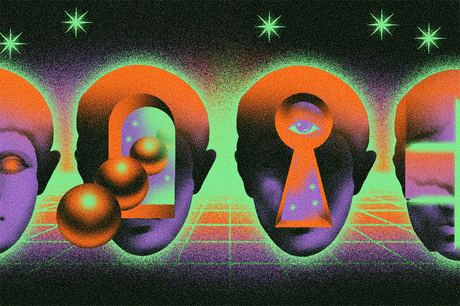

<style type="text/css">
.main-container {
  max-width: 1250px;
  margin-left: auto;
  margin-right: auto;
}

 /* unvisited link */
a:link {
  color: navy;
}

/* visited link */
a:visited {
  color: green;
}

/* mouse over link */
a:hover {
  color: purple;
}

/* selected link */
a:active {
  color: blue;
} 
</style>

```{r setup, include=FALSE}
knitr::opts_chunk$set(echo = TRUE)
```

<p align="center">
{width=800px}
</p>


## Reasons Why We Need Differential Privacy (DP)

There are various reasons why differential privacy is needed across different industries. DP does not only have an impact within data collection in healthcare settings, it can also be useful in business and marketing settings, 
<blockquote>

<b>Health Care:</b> As differential privacy changes the process for accessing data, rather than the database itself, it can enable patients' privacy without compromising on the usability of the data. Not only that, but patient trust is absolutely vital for medical organizations, including big hospitals and private practitioners. Without patient trust, it's difficult to give people the healthcare they need and to ensure that they follow professional medical recommendations. If hospital organizations do not protect and keep patient data organized, their professionals or staff members could come to incorrect conclusions, leading to wrong diagnoses, improper prescriptions, and other mistakes.


<b>Businesses and Digital Advertising:</b> DP is important for businesses because: It can help businesses to comply with data privacy regulations such as GDPR and CCPA without undermining their ability to analyze their customer behavior. Failure to comply with these regulations can result in serious fines.


<b>Other:</b> DP’s largest general use case to date will be the 2020 US Census. It is also worth noting differential privacy has been the core methodology for Apple in iOS (and not without some early concerns to its epsilon values). There is a lot of documentation on the web about differential privacy including open source libraries from Google and TensorFlow.

</blockquote>

<p>&nbsp;</p>
## Understanding DP in our Modern World and its Many Challenges

Knowing the Amount of Noise (or epsilon) to add to data is important to know how much of a person's privacy is being protected. However, there are several issues and challenges which arise from DP. If improper procedures (or improperly-documented procedures) are used to subtract out the noise in data, it can lead to a false sense of accuracy or false conclusions. Not only that, but there are various other challenges with DP. 

<blockquote>

<b>1:</b> Reconciling rigorous measures of leakage with existing legal requirements. For example, the United States federal regulations define what it means for health information to not be “identifiable” and thus not subject to privacy protections. Under these regulations, it would be sufficient to remove quanti identifiers on a specific list (exact addresses, Social Security numbers, etc.) as long as the entity releasing the information is not aware that what it is releasing can be used to identify someone “alone or in combination with other information.” The power of linking attacks — and the extent of other available data sets — has grown dramatically in the past two decades. Almost any detailed record can be used to identify someone.

<b>2:</b> Writing new legislation that takes into account the capabilities and limitations of modern privacy attacks and protections. The GDPR, the European Union’s data protection and privacy regulation, which imposes obligations onto organization from anywhere who collect data or target people from EU. Vitaly (and et. al) include in the article that Cummings and Desai argue that state-of-the-art machine learning models do not meet the GDPR’s standard: “most recommender systems (and many other types of machine learning models) memoize [emphasis added] individual data entries as they are trained, and thus are not sufficiently anonymized to be GDPR compliant.”


<b>3:</b> Maintaining usable data for researchers. Vitaly (and et. al) mention that social scientists are greatly concerned by the Census Bureau’s use of differential privacy. They worry that differential privacy is an unrealistically ambitious privacy standard that would make it impossible to do the sort of research that has become standard in recent years in subjects such as “poverty, inequality, immigration, internal migration, ethnicity, residential segregation, disability, transportation, fertility, nuptiality, occupational structure, education, and family change.”


<b>4:</b> Governance of private data. Vitaly (and et. al) argue, "Who gets to allocate priorities among researchers from different disciplines and methodological traditions? In the past, databases were seen as an evergreen resource — one person asking a question did not then limit another person’s ability to ask something. This is a fundamental shift in how data are viewed and will require significant structural changes in data governance."


</blockquote>


<i>Differential Privacy: Issues for policymakers. Simons Institute for the Theory of Computing. (2020, August 30). https://simons.berkeley.edu/news/differential-privacy-issues-policymakers </i>


<p>&nbsp;</p>

